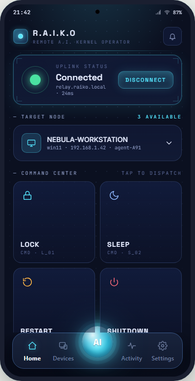
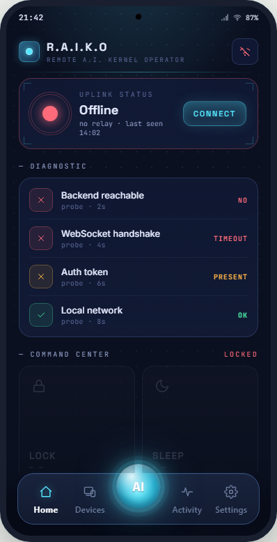
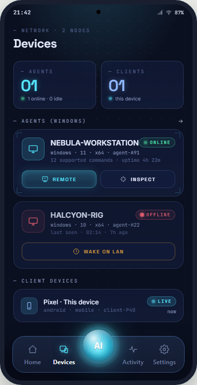
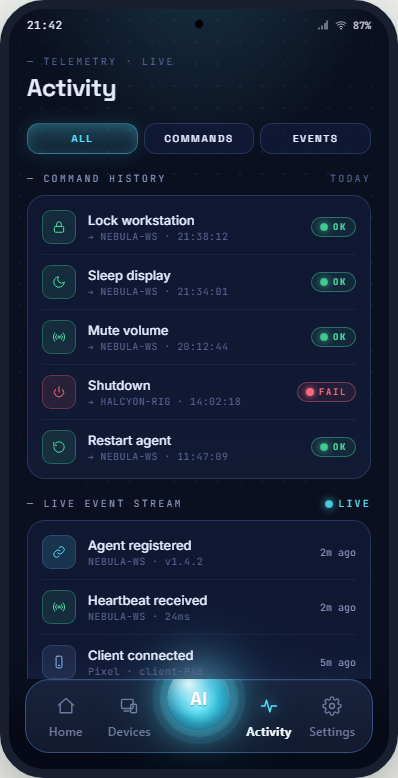
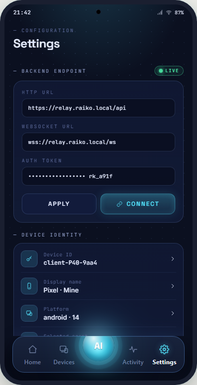
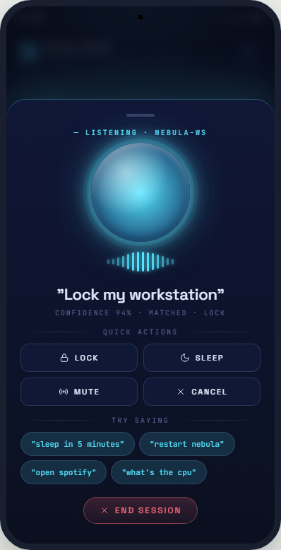
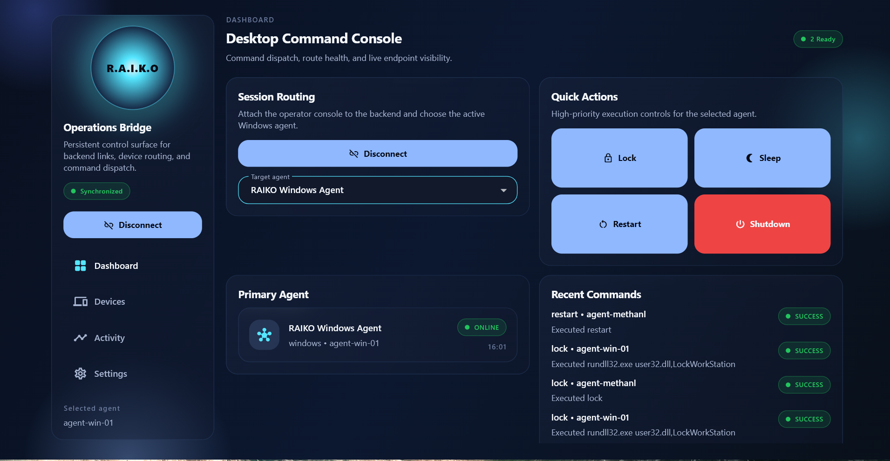

# R.A.I.K.O

R.A.I.K.O — the **Remote Artificial Intelligence Kernel Operator** — is a monorepo
for a remote Windows control platform. A mobile (and desktop) Flutter app talks to a
Fastify + WebSocket backend, which dispatches commands to a Windows agent running on
the target PCs. The agent can lock, sleep, restart, shut down, or open apps on the
host, with realtime online/offline state surfaced back to the phone.

## Mobile App Screenshots

<div style="display: flex; gap: 10px; overflow-x: auto; padding: 10px 0; scroll-behavior: smooth;">
  
  
  
  
  
  
</div>

## Desktop App Screenshots

<div >
  
</div>


## Repository Layout

```text
apps/
  mobile/          Flutter mobile client (Android + iOS)
  desktop/         Flutter Windows client (scaffolded)
  backend/         Fastify + WebSocket control backend (TypeScript, PostgreSQL)
  agent-windows/   Workspace-aware Windows Node agent (dev mode)

packages/
  raiko_ui/        Shared Flutter widgets
  shared_theme/    Shared Flutter tokens and theme
  shared_types/    Shared TypeScript contracts (used by backend + agent)

tools/
  standalone-agent.mjs    Single-file agent for any Windows PC (no monorepo needed)
  build.mjs               esbuild + pkg bundler -> tools/dist/raiko-agent.exe
  config.example.json     Template for the agent's runtime config
  package.json            Bundling toolchain (ws, esbuild, @yao-pkg/pkg)

docs/
  ARCHITECTURE.md         System design
  SRS.md                  Software requirements
  CODEX_PROMPTS.md        Prompt-by-prompt build checklist
  WORK_DONE.md            Implementation log
  PRODUCTION_PLAN.md      Deploy roadmap (Coolify + Cloudflare)
  STATUS_REPORT.md        Latest snapshot

Dockerfile               Multi-stage Alpine Node 22 image for the backend
.dockerignore            Excludes Flutter apps, docs, and bundle artefacts
ecosystem.config.cjs     pm2 config (alternative: run backend on a Windows host)
```

## Stack

- **Flutter** — mobile and desktop apps, shared via the `raiko_ui` and
  `shared_theme` packages.
- **Node.js + TypeScript** — backend and agent. Workspaces are managed at the repo
  root (`npm install` once).
- **Fastify** — HTTP API.
- **WebSocket (`ws`)** — realtime device registration, heartbeat, and command
  dispatch.
- **PostgreSQL** — persistence for devices, agents, activity, and command history.
  Schema migrations run automatically on backend boot when
  `RAIKO_RUN_MIGRATIONS=true`.
- **Docker / Coolify** — production deployment path. The bundled `Dockerfile`
  builds the backend into a single Alpine image.

## Mobile App Highlights

- Per-device persistent UUID (no more hardcoded `mobile-android-01`).
- Backend URL + auth token persisted via `shared_preferences`.
- Auto-reconnect with exponential backoff and a `Connecting…` button state.
- Snackbars surface connection errors and command results.
- Glassmorphism dashboard, animated voice orb, modular feature folders.

## Standalone Windows Agent

A self-contained agent lives in `tools/`. Two ways to run it:

**A. As a Node script** (any PC with Node 18+):
```bash
cd tools
npm install
# put a config.json next to standalone-agent.mjs (see config.example.json)
npm start
```

**B. As a single `.exe`** (no Node install on the target PC):
```bash
cd tools
npm install
npm run bundle           # produces dist/raiko-agent.exe (~43 MB)
```
Drop `raiko-agent.exe` and a filled-out `config.json` in the same folder on the
target Windows machine and double-click. The agent reads the config beside the
binary, opens a WebSocket to the backend, and registers itself.

Supported commands: `shutdown`, `restart`, `sleep`, `lock`, `open_app`. Set
`"dryRun": true` in the config for a safe smoke test.

## Workspace Commands

Install JS dependencies (workspaces resolve in one shot):
```bash
npm install
```

Build all Node workspaces:
```bash
npm run build
```

Run the backend in watch mode:
```bash
npm run dev:backend
```

Run backend migrations explicitly (auto-runs in production):
```bash
npm run migrate --workspace @raiko/backend
```

Run the (workspace-aware) Windows agent in watch mode:
```bash
npm run dev:agent
```

Flutter apps and packages are managed in their own directories with the standard
`flutter pub get`, `flutter analyze`, and `flutter test` workflows.

Build a release APK pointed at production:
```bash
cd apps/mobile
flutter build apk --release \
  --dart-define=RAIKO_BASE_HTTP_URL=https://raiko.<your-domain> \
  --dart-define=RAIKO_WEBSOCKET_URL=wss://raiko.<your-domain>/ws \
  --dart-define=RAIKO_AUTH_TOKEN=<token>
```

## Deployment

Two supported paths.

### Coolify (recommended, with custom domain)

The repo's `Dockerfile` is a multi-stage Alpine Node 22 build that compiles
`@raiko/shared-types` and `@raiko/backend`, then runs migrations on start. Coolify
handles Docker build, Let's Encrypt, and reverse-proxy automatically.

1. Cloudflare DNS: add `A` record `raiko.<your-domain>` → server IP (gray cloud).
2. Coolify: create a PostgreSQL resource, grab the internal connection string.
3. Coolify: create an Application from this repo, build pack **Dockerfile**, port
   `8080`, healthcheck `/health`. Set env vars:
   ```
   RAIKO_DATABASE_URL=postgres://postgres:<pass>@raiko-db:5432/postgres
   RAIKO_DATABASE_SSL_MODE=disable
   RAIKO_AUTH_TOKEN=<openssl rand -hex 32>
   ```
4. Bind `raiko.<your-domain>`, enable Let's Encrypt, deploy.

Full runbook in [docs/PRODUCTION_PLAN.md](docs/PRODUCTION_PLAN.md).

### pm2 on a Windows host (LAN-only fallback)

`ecosystem.config.cjs` at the repo root keeps the backend alive on a Windows
machine. Useful when there's no server to deploy to yet.

```bash
npm install -g pm2 pm2-windows-startup
npm run build
pm2 start ecosystem.config.cjs
pm2 save
pm2-startup install
```

## Required Environment

Backend (set in Coolify env tab or `apps/backend/.env`):
- `RAIKO_DATABASE_URL` — Postgres connection string (required)
- `RAIKO_AUTH_TOKEN` — strong shared secret (required for non-dev)
- `RAIKO_DATABASE_SSL_MODE` — `disable` | `require` (default `disable`)
- `RAIKO_HOST` / `RAIKO_PORT` — defaults `0.0.0.0` / `8080`
- `RAIKO_RUN_MIGRATIONS` — `true` to auto-migrate on boot

Agent (in `config.json` next to the exe, or via env):
- `backendWsUrl` / `RAIKO_BACKEND_WS_URL`
- `authToken` / `RAIKO_AUTH_TOKEN`
- `agentId`, `agentName`, `dryRun`, `heartbeatMs`, `reconnectMs` (optional)

Examples live at `apps/backend/.env.example`,
`apps/agent-windows/.env.example`, and `tools/config.example.json`.


## Documentation

- [Architecture](docs/ARCHITECTURE.md)
- [SRS](docs/SRS.md)
- [Production Plan](docs/PRODUCTION_PLAN.md)
- [Status Report](docs/STATUS_REPORT.md)
- [Prompt Checklist](docs/CODEX_PROMPTS.md)
- [Work Log](docs/WORK_DONE.md)
