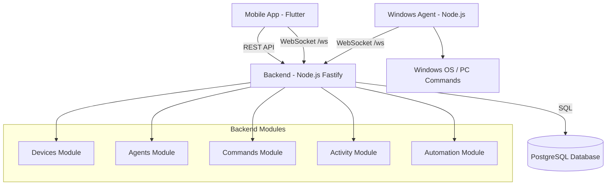
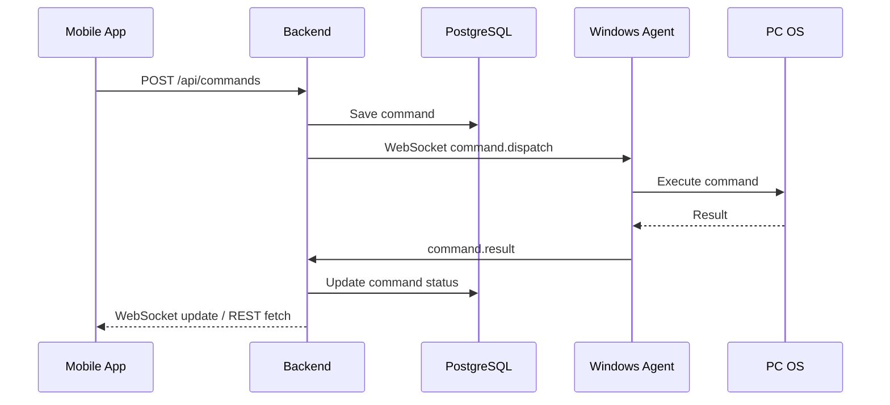
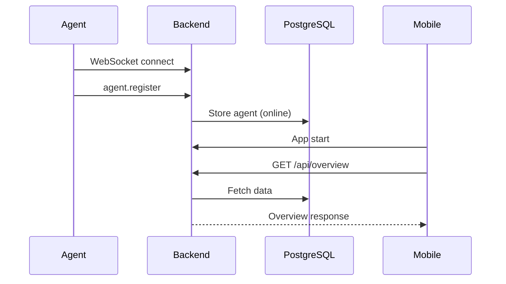
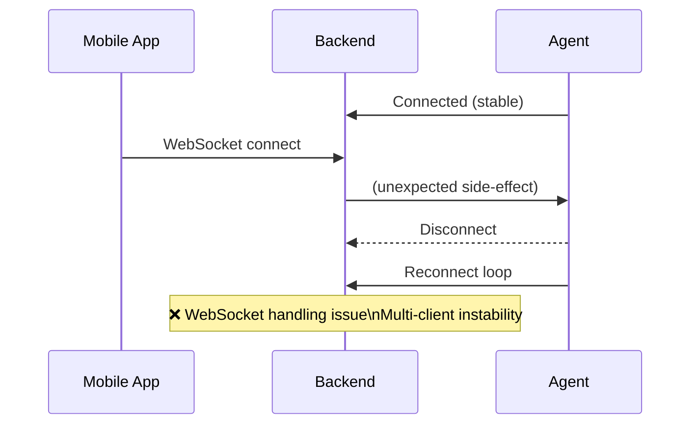
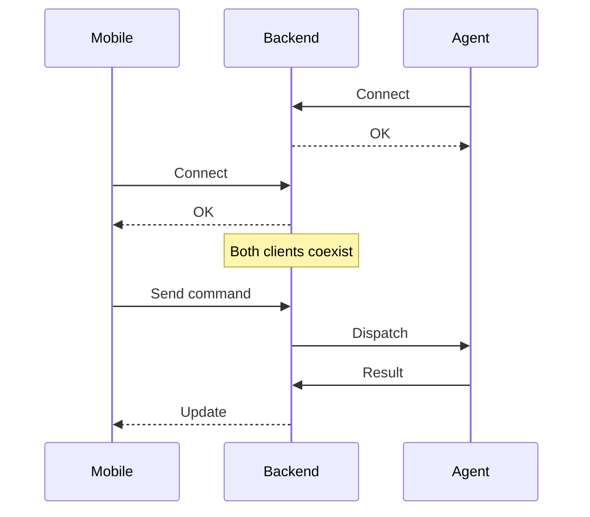
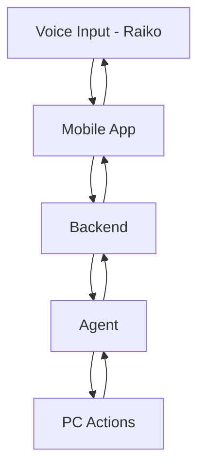

# R.A.I.K.O Project – Full Technical Handoff Report

## 1. Project Overview

R.A.I.K.O is a cross-platform remote control and automation system designed as a personal assistant (similar in spirit to Jarvis).

### Core Idea

Control a desktop machine from a mobile device via a central backend:

```
Mobile App (Flutter)
        ↓
Backend (Node.js + WebSocket + REST + PostgreSQL)
        ↓
Windows Agent (Node.js)
        ↓
PC (OS-level commands)
```

### Key Capabilities (Target Vision)

* Remote command execution (shutdown, lock, open apps)
* Real-time device/agent monitoring
* Activity tracking
* Automation rules (future)
* Voice assistant interface (future)

---

## 2. Architecture

### Backend

* Framework: Fastify (Node.js)
* Protocols:

  * REST API (`/api/*`)
  * WebSocket (`/ws`)
* Database: PostgreSQL
* Auth: simple token (`x-raiko-token`)
* Modules:

  * Devices
  * Agents
  * Commands
  * Activity
  * Automation (basic placeholder)

### Windows Agent

* Node.js service
* Connects via WebSocket
* Registers as an agent
* Executes commands (currently dry-run capable)
* Sends heartbeat + command results

### Mobile App (Flutter)

* UI Dashboard:

  * Home
  * Devices
  * Activity
  * Settings
* Uses:

  * REST for data fetch
  * WebSocket for realtime
* Configurable backend connection

---

## 3. Current Implementation Status

### ✅ Backend

* PostgreSQL fully integrated
* Migrations working
* REST endpoints implemented:

  * `/api/overview`
  * `/api/devices`
  * `/api/agents`
  * `/api/activity`
  * `/api/commands`
* WebSocket gateway working
* Token authentication enforced

### ✅ Critical Fixes Implemented

* Startup reconciliation:

  * Stale `online` devices/agents are set to `offline` on restart
* Security fix:

  * Unknown `command.result` messages are rejected

### ✅ Windows Agent

* Connects successfully
* Registers correctly
* Supports commands:

  * shutdown
  * restart
  * sleep
  * lock
  * open_app
* Dry-run mode works
* Reconnect logic works

### ✅ Mobile App (Partial)

* Backend config system added
* Default config:

  * HTTP: `http://10.0.2.2:8080`
  * WS: `ws://10.0.2.2:8080/ws`
  * Token: `raiko-dev`
* REST client implemented
* WebSocket client implemented
* Auto-connect on startup
* Dashboard loads overview

---

## 4. Current Problem (Critical)

### ❌ Mobile Connection Instability

When the mobile app attempts to connect:

* Backend receives connection attempt
* Windows agent disconnects or reconnect loops
* Mobile fails to establish stable connection

### Observed Behavior

* Agent logs show repeated reconnects
* Backend logs show WebSocket issues (likely auth or payload related)
* Mobile app does not reach stable "linked" state

---

## 5. Likely Root Causes

Claude should investigate:

### 1. WebSocket Gateway Multi-Client Handling

* Possible shared state corruption between:

  * agent connection
  * mobile connection

### 2. Invalid Mobile Registration Payload

* Mobile may not be sending:

  * proper `device.register` event
  * correct structure per shared types

### 3. Token Handling Mismatch

* Mobile token may not be passed in WS handshake correctly
* Backend rejects → closes connection

### 4. Broadcast / State Update Bug

* Mobile connection triggers broadcast that interferes with agent connection

### 5. Connection Lifecycle Bug

* Improper handling of:

  * socket close
  * reconnect logic
  * client identification

---

## 6. What is Working End-to-End

✔ Backend + DB + Agent
✔ REST APIs
✔ Command dispatch (dry-run)
✔ WebSocket agent connection
✔ Restart safety
✔ Persistence

---

## 7. What is NOT Working

❌ Mobile stable connection
❌ Phone → Backend → Agent command flow
❌ Device registration from mobile
❌ Multi-client WebSocket stability

---

## 8. Missing Features (Next Phases)

### High Priority

* Fix mobile connection bug
* Stable multi-client WebSocket support
* Mobile device registration

### Medium Priority

* Real command execution (non-dry-run)
* Device pairing/auth system
* Settings persistence

### Future

* Voice assistant ("Raiko")
* Automation rules engine
* Notifications
* Remote access over internet
* Desktop UI

---

## 9. Immediate Task for Claude Code

### Primary Objective

Fix mobile connection without breaking agent connection.

### Requirements

* Multiple WebSocket clients must coexist:

  * 1+ agents
  * 1+ devices
* No cross-disconnect behavior
* Proper isolation of connection state

### Key Areas to Inspect

* websocket-gateway.ts
* device-registry.ts
* agent registration flow
* mobile websocket client
* auth token validation

---

## 10. Definition of Success

The system is considered stable when:

1. Backend runs
2. Agent connects and stays connected
3. Mobile app connects without disconnecting agent
4. `/api/overview` shows both:

   * agent
   * mobile device
5. Mobile sends command successfully
6. Agent executes (or dry-run executes) command
7. Result flows back to mobile

---

## 11. Final Note

This project is already in a strong MVP backend state.

The only blocking issue preventing a working product is:

> **WebSocket instability when multiple clients (mobile + agent) are connected**

Once resolved, the system becomes a fully functional remote control platform.

---

## 12. Diagrams

### 1. System Architecture Diagram




### 2. Command Flow (End-to-End)




### 3. Startup / Connection Flow




### 4. Current Bug (Critical Issue)




### 5. Desired Stable Behavior (Target)




### 6. Future Vision (Raiko Assistant)


